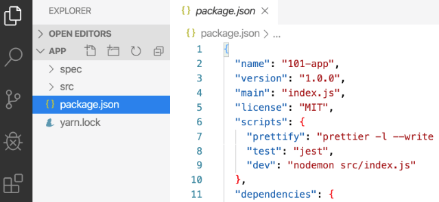

# Docker Labz
A ideia aqui desse repositóeio é aprender Docker do zero mesmo, sem enrolação e seguindo as boas práticas de mercado. Vamos passar pelos seguintes tópicos abaixo até que seja possível ter um volume para nossa aplicação e tudo mais, inclusive um `Docker Compose`. Para maiores informações consulte sempre a documentação oficial do Docker.

## Sumario

- [Docker Labz](#docker-labz)
  - [Sumario](#sumario)
  - [What is Docker?](#what-is-docker)
    - [Get the app](#get-the-app)
    - [Create the Dockerfile](#create-the-dockerfile)
    - [Buid your Dockerfile](#buid-your-dockerfile)
    - [Start the container](#start-the-container)
    - [Check and acess the app URL](#check-and-acess-the-app-url)
    - [Development](#development)
  - [Docker from Zero to Hero](#docker-from-zero-to-hero)
  - [Contributing](#contributing)
  - [License](#license)


## What is Docker?
Tudo começou em 2008, quando Solomon Hykes fundou a dotCloud, empresa especializada em PaaS com um grande diferencial: o seu Platform-as-a-Service não era atrelado a nenhuma linguagem de programação específica, como era o caso, por exemplo, da Heroku, que suportava somente aplicações desenvolvidas em Ruby. A grande virada na história da dotCloud ocorreu em março de 2013, quando decidiram tornar open source o core de sua plataforma -- assim nascia o Docker!

As primeiras versões do Docker nada mais eram do que um wrapper do LXC integrado ao Union Filesystem, mas o seu crescimento foi fantástico e muito rápido, tanto que em seis meses seu GitHub já possuía mais de seis mil stars e mais de 170 pessoas contribuindo para o projeto ao redor do mundo. Com isso, a dotCloud passou a se chamar Docker e a versão 1.0 foi lançada apenas 15 meses após sua versão 0.1. A versão 1.0 do Docker trouxe muito mais estabilidade e foi considerada "production ready", além de trazer o Docker Hub, um repositório público para containers. Baseado em [Descomplicando Docker](https://github.com/badtuxx/DescomplicandoDocker).

### Get the app
Para que possamos começar de buenas, clique [aqui](https://github.com/docker/getting-started/tree/master/app) para que você obtenha os dados da app. Agora que você tem baixado essa app localmente, tenha certeza que está com a seguinte estrutura abaixo:




### Create the Dockerfile
Para que possamos prosseguir de forma correta, vamos agora criar nosso Dockerfile, seguindo este modelo abaixo. Apenas uma ressalva, não se esqueça de criar o arquivo de Dockerfile no mesmo nível do arquivo `package.json`.

- Crie o arquivo chamado `Dockerfile` e insira esse conteúdo dentro do arquivo:

```dockerfile
# syntax=docker/dockerfile:1
FROM node:12-alpine
RUN apk add --no-cache python2 g++ make
WORKDIR /app
COPY . .
RUN yarn install --production
CMD ["node", "src/index.js"]
EXPOSE 3000
```

### Buid your Dockerfile
Hora de criar o build do Dockerfile, veja o comando abaixo para ajustar:

` docker build -t getting-started .`


<details><summary><b></b> <em>(clique para ver a resposta)</em></summary>

```bash
Sending build context to Docker daemon  4.654MB   
Step 1/7 : FROM node:12-alpine
 ---> bb6d28039b8c
Step 2/7 : RUN apk add --no-cache python2 g++ make
 ---> Running in a067c51c395d
fetch https://dl-cdn.alpinelinux.org/alpine/v3.15/main/x86_64/APKINDEX.tar.gz
fetch https://dl-cdn.alpinelinux.org/alpine/v3.15/community/x86_64/APKINDEX.tar.gz
(1/22) Installing binutils (2.37-r3)
(2/22) Installing libgomp (10.3.1_git20211027-r0)
(3/22) Installing libatomic (10.3.1_git20211027-r0)
(4/22) Installing libgphobos (10.3.1_git20211027-r0)
(5/22) Installing gmp (6.2.1-r1)
(6/22) Installing isl22 (0.22-r0)
(7/22) Installing mpfr4 (4.1.0-r0)
(8/22) Installing mpc1 (1.2.1-r0)
(9/22) Installing gcc (10.3.1_git20211027-r0)
(10/22) Installing musl-dev (1.2.2-r7)
(11/22) Installing libc-dev (0.7.2-r3)
(12/22) Installing g++ (10.3.1_git20211027-r0)
(13/22) Installing make (4.3-r0)
(14/22) Installing libbz2 (1.0.8-r1)
(15/22) Installing expat (2.4.7-r0)
(16/22) Installing libffi (3.4.2-r1)
(17/22) Installing gdbm (1.22-r0)
(18/22) Installing ncurses-terminfo-base (6.3_p20211120-r1)
(19/22) Installing ncurses-libs (6.3_p20211120-r1)
(20/22) Installing readline (8.1.1-r0)
(21/22) Installing sqlite-libs (3.36.0-r0)
(22/22) Installing python2 (2.7.18-r4)
Executing busybox-1.34.1-r5.trigger
OK: 229 MiB in 38 packages
Removing intermediate container a067c51c395d
 ---> b2d61b824b3f
Step 3/7 : WORKDIR /app
 ---> Running in 8b5bc690e742
Removing intermediate container 8b5bc690e742
 ---> 4fcb2e6472f6
Step 4/7 : COPY . .
 ---> e80020eac517
Step 5/7 : RUN yarn install --production
 ---> Running in 5d658e33e289
yarn install v1.22.18
[1/4] Resolving packages...
warning Resolution field "ansi-regex@5.0.1" is incompatible with requested version "ansi-regex@^2.0.0"
warning Resolution field "ansi-regex@5.0.1" is incompatible with requested version "ansi-regex@^3.0.0"
[2/4] Fetching packages...
[3/4] Linking dependencies...
[4/4] Building fresh packages...
Done in 12.93s.
Removing intermediate container 5d658e33e289
 ---> 6fca0dcd5d22
Step 6/7 : CMD ["node", "src/index.js"]
 ---> Running in 26d081688136
Removing intermediate container 26d081688136
 ---> fc006139a264
Step 7/7 : EXPOSE 3000
 ---> Running in c0ecacfd20dc
Removing intermediate container c0ecacfd20dc
 ---> 633c01ce663d
Successfully built 633c01ce663d
Successfully tagged getting-started:latest
```
</details>

### Start the container
Hora de criar nosso container, para isso siga as etapas abaixo:

`# docker run -dp 3000:3000 getting-started`

- Visualizando  a saida do comando, perceba que existe outros containers rodando, se atente apenas nesse que estamos criando.

<details><summary><b></b> <em>(clique para ver a resposta)</em></summary>

```bash
# docker container ls
CONTAINER ID   IMAGE                   COMMAND                  CREATED         STATUS          PORTS                                                 NAMES
bc63ea004a6e   getting-started         "docker-entrypoint.s…"   6 seconds ago   Up 5 seconds    0.0.0.0:3000->3000/tcp, :::3000->3000/tcp             priceless_tu
58a335a79b98   kindest/node:v1.21.1    "/usr/local/bin/entr…"   33 hours ago    Up 6 hours      127.0.0.1:45229->6443/tcp                             kind-control-plane
100358c88659   kindest/node:v1.21.1    "/usr/local/bin/entr…"   33 hours ago    Up 6 hours                                                            kind-worker
29feb5952c3d   kindest/node:v1.21.1    "/usr/local/bin/entr…"   33 hours ago    Up 6 hours                                                            kind-worker2
47aaf241467d   rancher/server:stable   "/usr/bin/entry /usr…"   4 months ago    Up 22 seconds   3306/tcp, 0.0.0.0:8081->8080/tcp, :::8081->8080/tcp   determined_dubinsky
```
</details>

### Check and acess the app URL

Uma vez feita a criação do container, acesse seu browser e veja a app rodando em `http://localhost:3000`

### Development

This project has a `docker-compose.yml` file, which will start the mkdocs application on your
local machine and help you see changes instantly.

```bash
docker-compose up
```

## Docker from Zero to Hero
Para que você possa aprender Docker do zero, de forma gratuita, com material de qualidade e boa didática, comece por esse curso ministrado pelo Jefferson da [LINUXtips](https://www.linuxtips.io/). Clique [aqui](https://www.youtube.com/watch?v=Wm99C_f7Kxw&list=PLf-O3X2-mxDn1VpyU2q3fuI6YYeIWp5rR&ab_channel=LINUXtips) para que você comece hoje mesmo com Docker.

## Contributing
Pull requests are welcome. For major changes, please open an issue first to discuss what you would like to change.

Please make sure to update tests as appropriate.

## License
[GNU GENERAL PUBLIC LICENSE](https://github.com/Docker-Tutorialz/sample-application/blob/main/LICENSE)